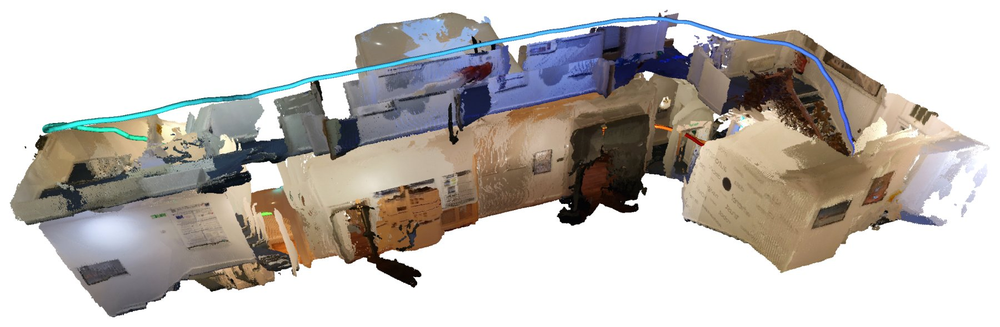

# DAVIO

**Dense monocular–inertial SLAM with feed-forward initialization and pose-conditioned mapping.**

DAVIO runs [OpenVINS](https://github.com/rpng/open_vins) filter with
[Depth Anything 3](https://github.com/ByteDance-Seed/Depth-Anything-3) at both ends of it:
a five-image window bootstraps the filter before parallax exists, and the filter's metric
poses then condition the same model, so the dense map it builds online is metric.

<p align="center"></p>

**[Project page](https://be2rlab.github.io/DAVIO/)** · **[Paper](#citation)**

---

## Install

You need Linux, Docker with the [NVIDIA container toolkit](https://docs.nvidia.com/datacenter/cloud-native/container-toolkit/install-guide.html),
an NVIDIA GPU (6 GB is enough) and about 30 GB of disk. Everything else — CUDA, ROS 2,
Torch, OpenVINS — is built into a container image, and every `./davio` command runs there
for you.

```bash
git clone --recursive https://github.com/be2rlab/DAVIO.git && cd DAVIO
make setup          # images, OpenVINS, the binding, model weights (about an hour, once)
./davio doctor      # checks every piece and says what is missing
```

`make help` lists the steps if you would rather run them one at a time; [docs/SETUP.md](docs/SETUP.md)
has the details and the fixes for what can go wrong.

## Run on EuRoC

```bash
make euroc                        # V1_01_easy and MH_01_easy into data/euroc
./davio run V1_01_easy            # online, at sensor rate, then scored
./davio view runs/V1_01_easy      # 3D viewer: trajectory and dense map
```

Any EuRoC sequence works: `make euroc SEQS="V2_01_easy MH_04_difficult"`.

## Run on ORI

```bash
make ori                                    # r01 into data/ori (SEQ=r02 ... r05 for others)
./davio run r01 --dataset ori --rate 0      # unpaced: 1472x1440 at 30 Hz is more than
                                            # a laptop GPU maps in real time
```

## Record with a phone

[`vi_recorder/visual_inertial_recorder.apk`](vi_recorder/visual_inertial_recorder.apk) records
the rear camera and IMU on an Android phone, timestamped on one clock.

1. Install it: `adb install vi_recorder/visual_inertial_recorder.apk` (or copy the APK to the
   phone and open it), and grant camera access.
2. Hold the phone in landscape and record. Aim for 30 Hz with no dropped frames, and move it
   a little in every direction during the first seconds so the filter can initialize.
3. Copy the session folder (`frames.bin`, `frames.jsonl`, `imu.csv`, `metadata.json`) to the
   host, then convert and run it:

```bash
python3 vi_recorder/vir.py SESSION                          # frame count, duration, rate
python3 vi_recorder/to_asl.py SESSION data/custom/my_walk   # EuRoC/ASL layout
./davio rig data/custom/my_walk
./davio run my_walk --dataset custom
```

The recorder's intrinsics are uncalibrated and its camera–IMU extrinsic is only a prior; see
[docs/CUSTOM_DATA.md](docs/CUSTOM_DATA.md) for turning on online calibration.

## Run on your own data

A recording in EuRoC/ASL layout (`mav0/cam0/data/*.png|jpg`, `mav0/imu0/data.csv`) goes
under `data/custom/`, with its calibration in a `calibration/` folder beside `mav0/` —
Kalibr's `*camchain-imucam.yaml`, or Basalt's `calibration.json`:

```bash
./davio rig data/custom/my_walk                 # OpenVINS rig from its calibration, once
./davio run my_walk --dataset custom            # then run it like any other sequence
```

No calibration at all? `./davio rig` falls back to what the recorder wrote and says what is
missing; DAVIO's initializer and OpenVINS's online calibration can recover. 
[docs/CUSTOM_DATA.md](docs/CUSTOM_DATA.md) covers layouts, phones, outdoor scenes
and what an uncalibrated recording can and cannot give you. For a live
**Intel RealSense D435i/D455** see [docs/REALSENSE.md](docs/REALSENSE.md).

## Evaluate

Every run on a dataset with a reference trajectory is scored when it finishes:

```
runs/V1_01_easy/evaluation.json    ATE, orientation error, coverage, latency, map staleness
```

```bash
./davio evaluate runs/V1_01_easy            # score again (e.g. against another reference)
./davio map runs/V1_01_easy                 # re-map offline: loop closure, nothing dropped
./davio evaluate runs/V1_01_easy_remap      # ATE of the loop-corrected map trajectory
./davio evaluate runs/V1_01_easy_remap --surface   # map accuracy / completeness vs the
                                                   # reference scan (EuRoC V1/V2, ORI)
```

What each number means, and which reference it is scored against, is in
[docs/EVALUATION.md](docs/EVALUATION.md).

## Look at the results

| | |
|---|---|
| `./davio view runs/X` | interactive viewer ([rerun](https://rerun.io)): trajectory, dense map, loops, live plots. `--follow` while a run is still going |
| `./davio export runs/X` | the fused map as one coloured `.ply` |
| `./davio render runs/X` | stills and a turntable, rendered offscreen with Open3D |
| `./davio render runs/X --build fly` | a video of the map being built, flying along the trajectory |
| `./davio compose VIDEO --run runs/X` | the camera frames beside that video, in sync |

Rendering runs on the host and needs `pip install open3d`. See [docs/VISUALIZE.md](docs/VISUALIZE.md).

## What is in here

```
davio               the command line; ./davio --help
src/davio/          runtime: engine, initializer, datasets, evaluation
src/davio_mapper/   dense back-end: submaps, depth scales, pose graph, loop closure
native/             the pybind11 binding to OpenVINS
config/             system.yaml (every setting) and one OpenVINS rig per dataset
scripts/            what the commands call: run, evaluate, map, view, render, fetch
tests/              ~250 tests; no GPU, dataset or binding needed
docker/             the images
vi_recorder/        Android recorder APK and its session converter
website/            the project page
```

Every setting lives in [config/system.yaml](config/system.yaml) and can be overridden per
run without editing it: `./davio run V1_01_easy --set mapping.keyframe_period_s=0.25`.

## Citation

```bibtex
@inproceedings{davio,
  title     = {DAVIO: Dense Monocular--Inertial SLAM with Feed-Forward
               Initialization and Pose-Conditioned Mapping},
  year      = {2026}
}
```

## License

GPL-3.0, see [LICENSE](LICENSE). OpenVINS (GPL-3.0), Depth Anything 3 (Apache-2.0 for
DA3-BASE) and XFeat (Apache-2.0) are third-party and carry their own licences.
